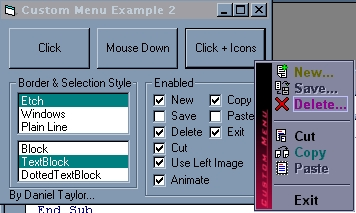



## Menu Replacement Version 2

### Description

~This is version 2 of my Menu Replacement control~

See below to see whats been changed since version 1.

Have you ever wanted to use your own custom menu instead of the one that comes with windows? You know, those little popup menus you get when you right-click on something, well, I've made a replacement for them (All source included). It lets you make a popup menu animated like the windows ones, but fully customizable. There is the .ocx source and a demo program that uses the menu.ocx to display an example menu. The code is commented and not too hard to understand. If you like the code please vote or leave comments. -Daniel Taylor (Dan@nknet.com) *This is a complete user-drawn menu** i don't use the windows popup menu at ALL...*

History:

~Verion 2.0~

+Optional Picture can be displayed on left side of menu.

+Menu now animates both width and height when opening.

+Fixed BackColor problem, now when backcolor is set on usercontrol, the menu's backcolor is the same.

+3 Selection Styles for when the mouse is over an item.

+Menu Items now have optional names for better control over the click event.

+Each menu item can have it's own Forecolor, HotForecolor, and HotBackcolor, when not specified they revert to the usercontrol's ItemForecolor, ItemHotForecolor, and ItemHotBackcolor values.

+When Menu is shown partly off the screen, it automatically moves itself back on.

~Version 1.0~

The Origional...

+Automatically resizes to whatever text you specify

+Backcolor, Forecolor, HotForecolor, and HotBackcolor all customizable

+3 BorderStyles.

+Easy To Implement, just 2 commands let you do almost everything.

+Completely Userdrawn, i.e. doesn't use any preexisting popupmenu, just a normal form.

+Menu optionally animates like Win98+ menus, i.e. the StartMenu.

+Animation speed is adjustable, so menu opens at different speeds.

~Things To Work On~

-Can't have child menus.

*In order to use this control you have to compile it yourself, since PlanetSourceCode deletes compiled .ocx files. Its easy, just open then MenuCtl.vbp file and click File -> Make Menu.ocx and then it will ask for a filename, make sure it's Menu.ocx. Once compiled you can run the example.vbp project without problems.*
 
### More Info
 

             |
---                |---
**Submitted On**   |2001-04-20 14:03:16
**By**             |[Daniel Taylor](https://github.com/Planet-Source-Code/PSCIndex/blob/master/ByAuthor/daniel-taylor.md)
**Level**          |Intermediate
**User Rating**    |4.1 (33 globes from 8 users)
**Compatibility**  |VB 4\.0 \(32\-bit\), VB 5\.0, VB 6\.0
**Category**       |[Custom Controls/ Forms/  Menus](https://github.com/Planet-Source-Code/PSCIndex/blob/master/ByCategory/custom-controls-forms-menus__1-4.md)
**World**          |[Visual Basic](https://github.com/Planet-Source-Code/PSCIndex/blob/master/ByWorld/visual-basic.md)
**Archive File**   |[Menu Repla185894202001\.zip](https://github.com/Planet-Source-Code/daniel-taylor-menu-replacement-version-2__1-22547/archive/master.zip)

